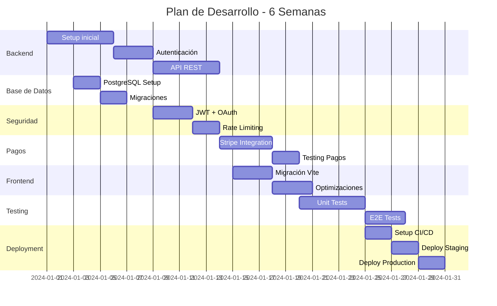

# 🚨 AUDITORÍA Y PLAN DE PRODUCCIÓN - INDI Digital Card Platform

## 📊 RESUMEN EJECUTIVO

**Estado Actual**: MVP/Demo - No apto para producción  
**Tiempo estimado para producción**: 4-6 semanas  
**Inversión estimada**: $3,000 - $5,000 USD  

---

## 🔴 PROBLEMAS CRÍTICOS IDENTIFICADOS

### 1. **SEGURIDAD (CRÍTICO)**
- ❌ **Sin autenticación real** - Solo simulación en frontend
- ❌ **API Key expuesta** - GEMINI_API_KEY en código cliente
- ❌ **Sin backend** - Todo el estado en localStorage (hackeable)
- ❌ **Sin validación de inputs** - Vulnerable a XSS/injection
- ❌ **Sin HTTPS** - Transmisión insegura
- ❌ **Sin rate limiting** - Vulnerable a DoS
- ❌ **Sin CORS configurado**

### 2. **ARQUITECTURA (CRÍTICO)**
- ❌ **Sin base de datos** - Solo localStorage
- ❌ **Sin API REST/GraphQL** - No hay backend
- ❌ **Sin sistema de pagos real** - Solo simulación
- ❌ **Sin CDN** - Assets servidos localmente
- ❌ **Sin sistema de archivos** - Fotos en URLs externas

### 3. **CONFIGURACIÓN (ALTO)**
- ⚠️ **React-scripts (CRA) deprecado** - Migrar a Vite
- ⚠️ **Configuración mixta** - Vite + CRA conflicto
- ⚠️ **Sin variables de entorno de producción**
- ⚠️ **Sin configuración de CI/CD**
- ⚠️ **Sin Docker**

### 4. **CÓDIGO (MEDIO)**
- ⚠️ **Sin tests** - 0% cobertura
- ⚠️ **Sin validación de formularios**
- ⚠️ **Manejo de errores básico**
- ⚠️ **TypeScript con `any` implícitos**
- ⚠️ **Sin documentación técnica**

### 5. **RENDIMIENTO (MEDIO)**
- ⚠️ **Bundle no optimizado** - 700KB+
- ⚠️ **Sin lazy loading**
- ⚠️ **Sin optimización de imágenes**
- ⚠️ **Sin cache strategy**
- ⚠️ **Sin Service Worker/PWA**

---

## ✅ PLAN DE IMPLEMENTACIÓN PARA PRODUCCIÓN

### **FASE 1: INFRAESTRUCTURA BACKEND (Semana 1-2)**

#### 1.1 Setup Backend con Node.js/Express
```bash
# Estructura propuesta
backend/
├── src/
│   ├── api/
│   │   ├── auth/
│   │   ├── cards/
│   │   ├── analytics/
│   │   └── payments/
│   ├── models/
│   ├── middleware/
│   ├── services/
│   └── utils/
├── tests/
└── package.json
```

#### 1.2 Base de Datos PostgreSQL
```sql
-- Esquema principal
CREATE TABLE users (
    id UUID PRIMARY KEY,
    email VARCHAR(255) UNIQUE NOT NULL,
    password_hash VARCHAR(255) NOT NULL,
    created_at TIMESTAMP DEFAULT NOW()
);

CREATE TABLE cards (
    id UUID PRIMARY KEY,
    user_id UUID REFERENCES users(id),
    data JSONB NOT NULL,
    is_published BOOLEAN DEFAULT false,
    slug VARCHAR(100) UNIQUE,
    created_at TIMESTAMP DEFAULT NOW()
);

CREATE TABLE analytics (
    id UUID PRIMARY KEY,
    card_id UUID REFERENCES cards(id),
    event_type VARCHAR(50),
    metadata JSONB,
    created_at TIMESTAMP DEFAULT NOW()
);
```

#### 1.3 Autenticación con JWT
```javascript
// Implementar:
- Login con email/password
- OAuth con Google
- Refresh tokens
- Password reset
- 2FA (opcional)
```

### **FASE 2: SEGURIDAD (Semana 2)**

#### 2.1 Variables de Entorno
```bash
# .env.production
NODE_ENV=production
DATABASE_URL=postgresql://...
JWT_SECRET=...
GEMINI_API_KEY=... (solo backend)
STRIPE_SECRET_KEY=...
AWS_S3_BUCKET=...
REDIS_URL=...
```

#### 2.2 Middleware de Seguridad
```javascript
// Implementar:
- Helmet.js para headers
- Rate limiting con Redis
- Input sanitization
- CORS configurado
- Session management
- CSP headers
```

### **FASE 3: SISTEMA DE PAGOS (Semana 3)**

#### 3.1 Integración Stripe/MercadoPago
```javascript
// Flujo de pago:
1. Cliente selecciona plan
2. Backend crea sesión de pago
3. Cliente completa pago
4. Webhook confirma pago
5. Activar suscripción
```

#### 3.2 Manejo de Suscripciones
```javascript
// Estados:
- trial (7 días)
- active
- past_due
- canceled
```

### **FASE 4: ALMACENAMIENTO Y CDN (Semana 3)**

#### 4.1 AWS S3 para imágenes
```javascript
// Flujo de upload:
1. Pre-signed URL desde backend
2. Upload directo a S3
3. CloudFront CDN
4. Optimización con Sharp
```

#### 4.2 Configuración CDN
```nginx
# CloudFront o Cloudflare
- Cache estático: 1 año
- Cache dinámico: 5 min
- Compresión Brotli
- HTTP/2
```

### **FASE 5: MIGRACIÓN FRONTEND (Semana 4)**

#### 5.1 Migrar a Vite puro
```bash
npm uninstall react-scripts
npm install -D @vitejs/plugin-react vite
```

#### 5.2 Optimizaciones
```javascript
// Implementar:
- Lazy loading de rutas
- Code splitting
- Image optimization
- Bundle analysis
- Tree shaking
```

### **FASE 6: TESTING Y QA (Semana 4-5)**

#### 6.1 Tests Unitarios
```javascript
// Jest + React Testing Library
- Componentes: 80% cobertura
- Utils: 100% cobertura
- API: 90% cobertura
```

#### 6.2 Tests E2E
```javascript
// Playwright
- Flujo de registro
- Creación de tarjeta
- Proceso de pago
- Compartir tarjeta
```

### **FASE 7: DEPLOYMENT (Semana 5-6)**

#### 7.1 Infraestructura
```yaml
# docker-compose.yml
version: '3.8'
services:
  backend:
    build: ./backend
    environment:
      - NODE_ENV=production
  
  frontend:
    build: ./frontend
    depends_on:
      - backend
  
  postgres:
    image: postgres:15
  
  redis:
    image: redis:7
```

#### 7.2 CI/CD con GitHub Actions
```yaml
# .github/workflows/deploy.yml
- Tests automáticos
- Build optimizado
- Deploy a AWS/Vercel
- Health checks
```

---

## 💰 PRESUPUESTO ESTIMADO

| Servicio | Costo Mensual |
|----------|---------------|
| AWS EC2 (Backend) | $20-40 |
| RDS PostgreSQL | $15-30 |
| S3 + CloudFront | $5-15 |
| Vercel (Frontend) | $20 |
| Dominio + SSL | $2 |
| SendGrid (Email) | $10 |
| Monitoring | $10 |
| **TOTAL** | **$82-127/mes** |

---

## 📋 CHECKLIST PRE-PRODUCCIÓN

### Seguridad
- [ ] Autenticación JWT implementada
- [ ] OAuth con Google
- [ ] Rate limiting configurado
- [ ] HTTPS en todos los endpoints
- [ ] Variables de entorno seguras
- [ ] Input validation
- [ ] XSS protection
- [ ] SQL injection prevention

### Backend
- [ ] API REST completa
- [ ] Base de datos PostgreSQL
- [ ] Sistema de caché Redis
- [ ] Queue para jobs (Bull)
- [ ] Logging con Winston
- [ ] Error tracking (Sentry)

### Frontend
- [ ] Migrado a Vite
- [ ] Bundle < 200KB
- [ ] Lazy loading
- [ ] PWA ready
- [ ] SEO optimizado
- [ ] Analytics (GA4/Mixpanel)

### Pagos
- [ ] Stripe/MercadoPago integrado
- [ ] Webhooks configurados
- [ ] Facturación automática
- [ ] Manejo de disputas

### DevOps
- [ ] Docker configurado
- [ ] CI/CD pipeline
- [ ] Monitoring (Datadog/NewRelic)
- [ ] Backups automáticos
- [ ] Disaster recovery plan

### Legal
- [ ] Términos y condiciones
- [ ] Política de privacidad
- [ ] GDPR compliance
- [ ] Cookies consent

---

## 🚀 RECOMENDACIONES PRIORITARIAS

1. **URGENTE**: Implementar backend con autenticación real
2. **URGENTE**: Mover API keys al backend
3. **CRÍTICO**: Configurar base de datos PostgreSQL
4. **CRÍTICO**: Implementar sistema de pagos real
5. **ALTO**: Migrar de CRA a Vite
6. **ALTO**: Implementar tests
7. **MEDIO**: Optimizar bundle y performance
8. **MEDIO**: Configurar CDN y caché

---

## 📅 TIMELINE SUGERIDO



---

## 👨‍💻 EQUIPO RECOMENDADO

- **1 Backend Developer** (Node.js/PostgreSQL)
- **1 Frontend Developer** (React/TypeScript)
- **1 DevOps** (AWS/Docker) - Part-time
- **1 QA Tester** - Part-time

---

## ⚠️ RIESGOS Y MITIGACIÓN

| Riesgo | Probabilidad | Impacto | Mitigación |
|--------|-------------|---------|------------|
| Fuga de datos | Alta | Crítico | Implementar seguridad desde día 1 |
| Fallo de pagos | Media | Alto | Testing exhaustivo + sandbox |
| Downtime | Media | Alto | Load balancer + replicas |
| Escalabilidad | Baja | Medio | Arquitectura microservicios |

---

## 📝 NOTAS FINALES

Este proyecto tiene un **excelente diseño UI/UX** y una base sólida de componentes React. Sin embargo, requiere una **reescritura significativa del backend** y mejoras de seguridad antes de ser viable para producción.

**Siguiente paso recomendado**: Comenzar con la implementación del backend y sistema de autenticación mientras se mantiene el frontend actual funcionando en modo demo.

---

*Documento generado el: 26/11/2024*  
*Auditor: Claude Code - Experto Fullstack*